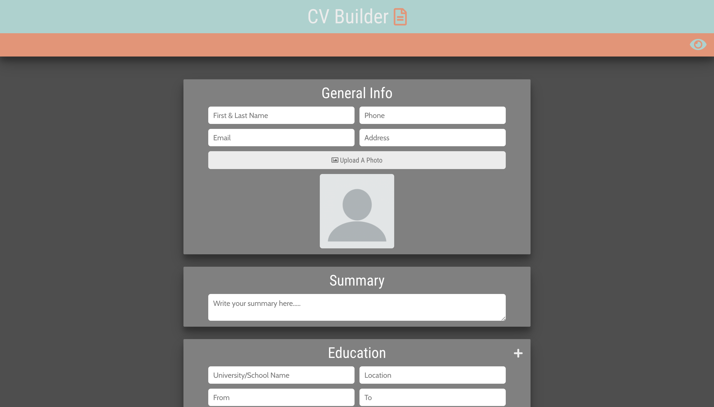

# CV Generator App

A React application which generates a CV from user entered data. 

### screenshot



### Built with

- HTML/SCSS
- CSS Grid
- Javascript
- [React](https://reactjs.org/) - JS library.
- React Hooks


### What I learned

My first Real React project showed me just how beneficial JavaScript frameworks are for keeping your projects much more manageable and organized. The ability to build HTML elements within the javascript file using JSX Is very intuitive and it's easy to see why being able to break projects down into reusable components is beneficial for developers.

I believe this project has given me a solid grasp of React Hooks and the React framework in general, and I am looking forward to using it in the future to build more complex projects.

### Features


## Get started

### Clone this repository

From your command line, first clone this repo: https://github.com/WeKiBan/new-portfolio

`$ git clone https://github.com/WeKiBan/new-portfolio`

### Go into the repository

`$ cd new-portfolio`

### Remove current origin repository

`$ git remote remove origin`

### Install dependencies

`$ npm install`

### Start development server

`$ npm start`

You should now have a development server running in your default browser.

```

```
