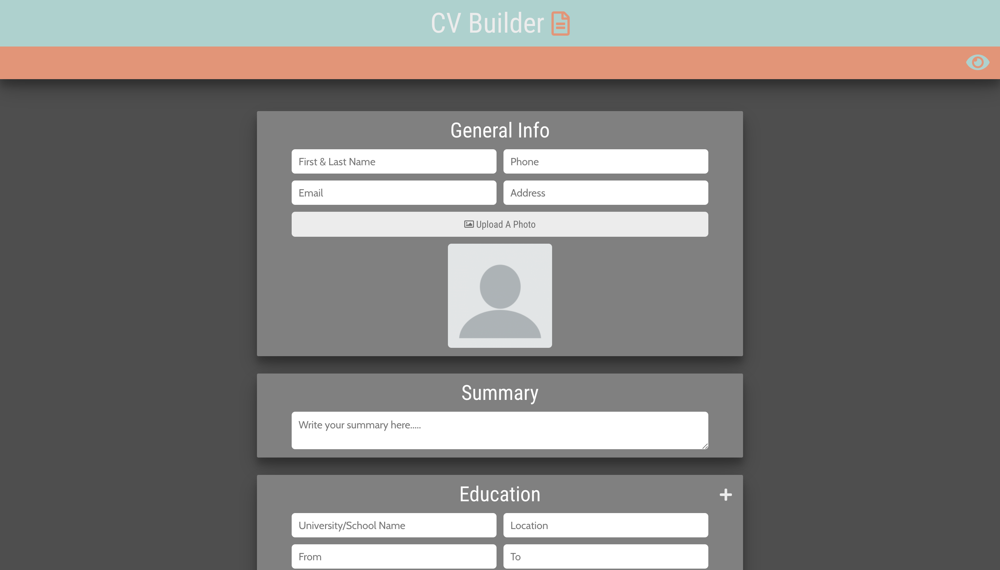
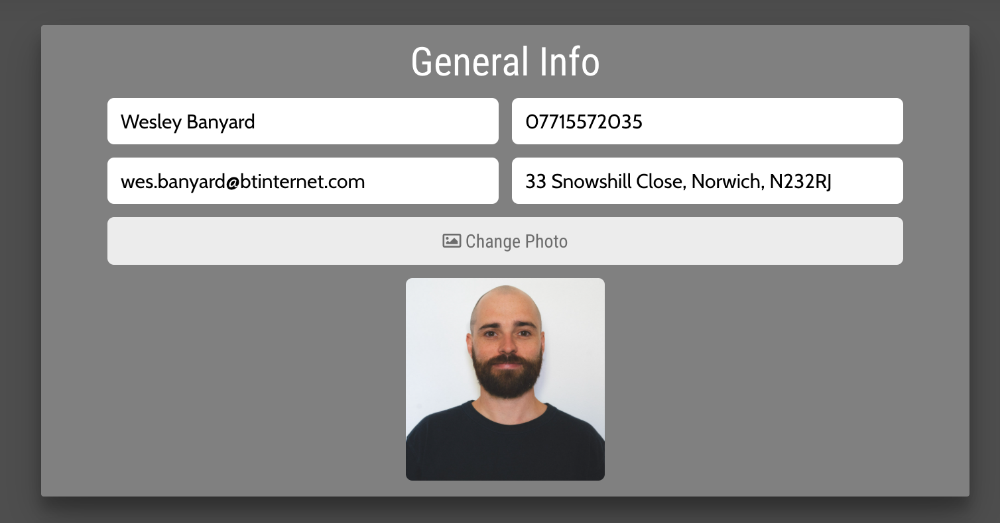
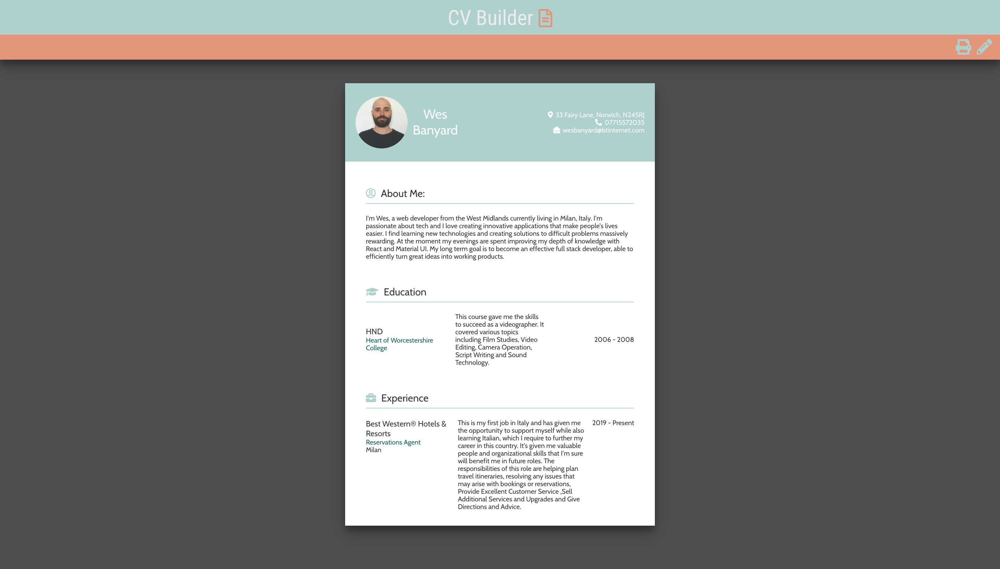

# CV Generator App

A React application which generates a CV from user entered data.

### Screenshot



### Built with

- HTML/SCSS
- CSS Grid
- Javascript
- [React](https://reactjs.org/) - JS library.
- React Hooks

### What I learned

My first Real React project showed me just how beneficial JavaScript frameworks are for keeping your projects much more manageable and organized. The ability to build HTML elements within the javascript file using JSX is very intuitive and it's easy to see why being able to break projects down into reusable components is beneficial for developers.

I believe this project has given me a solid grasp of React Hooks and the React framework in general and I am looking forward to gaining a more in depth knowledge while building more projects with it in the future.

### Features

The User is presented with various segments containing relating inputs and also the option to upload a portrait



This is the first time I have included a feature like the portrait upload in one of my apps and this was achieved by using an input type of file.

```javascript
<input
  onChange={handleFileSelectChange}
  className="display-none"
  type="file"
  name="image"
  accept="image/x-png,image/gif,image/jpeg"
/>
```

And then storing the file location using the useState hook.

```javascript
const [generalInfo, setGeneralInfo] = useState({
    name: '',
    phone: '',
    email: '',
    address: '',
    photo: '',
  });

const handleFileSelectChange = (e) => {
  e.preventDefault();
  setGeneralInfo({
    ...generalInfo,
    photo: URL.createObjectURL(e.target.files[0]),
  });
};
```

After inputting their data the user can then click the eye icon in the top right hand corner to go to a preview of their data injected into a formatted Resume.

They also have option to print the resume by clicking the print button located in the top right of the page. I did this using the `window.print()` method and a `@print media` query to only display the required parts of the page.



## Get started

### Clone this repository

From your command line, first clone this repo: https://github.com/WeKiBan/new-portfolio

`$ git clone https://github.com/WeKiBan/new-portfolio`

### Go into the repository

`$ cd new-portfolio`

### Remove current origin repository

`$ git remote remove origin`

### Install dependencies

`$ npm install`

### Start development server

`$ npm start`

You should now have a development server running in your default browser.

```

```
